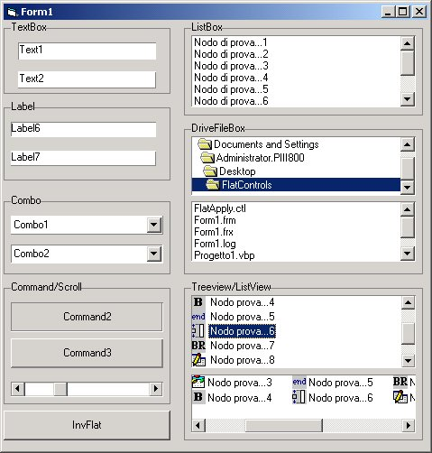



## flatBorders

### Description

FlatControl a Frame flat for all the controls

This simple code allows you to replace the border 3D of the you standard controls

of microsoft, with border flat or with the colors that preferred.

It doesn't use subclassing and all is managed in way simple and immediate,

few property allow to choose the colors of the border and the style inset/raised,

flatControl is associated to the control to be modified through the simple call

to the function apply3d.

es. ' Flatcontrol1.appli3D Text.1 its all
 
### More Info
 

             |
---                |---
**Submitted On**   |2001-08-30 01:33:38
**By**             |[Mark](https://github.com/Planet-Source-Code/PSCIndex/blob/master/ByAuthor/mark.md)
**Level**          |Advanced
**User Rating**    |5.0 (50 globes from 10 users)
**Compatibility**  |VB 4\.0 \(16\-bit\), VB 4\.0 \(32\-bit\), VB 5\.0, VB 6\.0
**Category**       |[OLE/ COM/ DCOM/ Active\-X](https://github.com/Planet-Source-Code/PSCIndex/blob/master/ByCategory/ole-com-dcom-active-x__1-29.md)
**World**          |[Visual Basic](https://github.com/Planet-Source-Code/PSCIndex/blob/master/ByWorld/visual-basic.md)
**Archive File**   |[flatBorder255608292001\.zip](https://github.com/Planet-Source-Code/mark-flatborders__1-26788/archive/master.zip)

